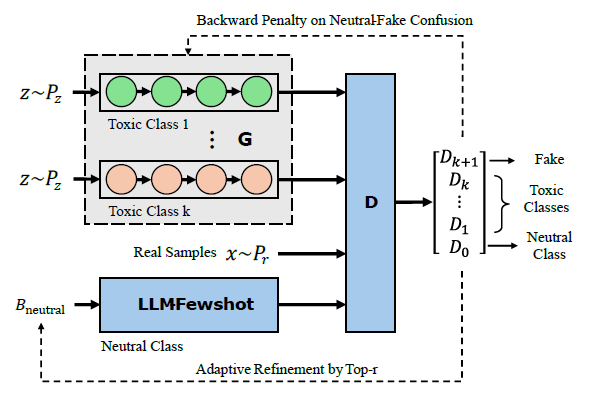
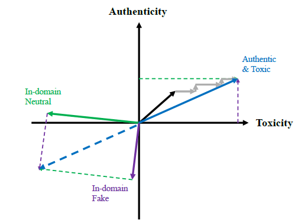

# ToxiGAN: Toxic Data Augmentation via LLM-Guided Directional Adversarial Generation

> **Paper:** Li, P., Fillies, J., & Paschke, A. (2026). EACL 2026. [[arXiv]](https://arxiv.org/abs/2601.03121)

---

## Abstract

Online toxicity remains a critical challenge for content moderation systems. A core bottleneck is **data imbalance** — toxic comments are significantly outnumbered by non-toxic ones in real-world datasets, leading classifiers to underperform on the minority (toxic) class. 

ToxiGAN addresses this through **adversarial data augmentation**: it trains class-specific LSTM generators to produce synthetic toxic text that is both *authentically toxic* and *stylistically realistic*, guided by a BERT-based multi-class discriminator and an LLM-based neutral text provider (via Ollama). The generated samples are then used to augment the training data of downstream toxicity detection classifiers.

**Key contributions:**
- **Multi-class GAN architecture** with K toxic generators, one LLM-based neutral provider, and a (K+2)-class discriminator
- **Two-step alternating directional learning** — generators are pushed toward both toxicity and authenticity via alternating semantic and discriminator penalties
- **LLM-ballast mechanism** — an Ollama-backed neutral text provider that evolves its few-shot examples based on discriminator feedback
- **Downstream evaluation** across three classifier architectures (DistilBERT, BiLSTM, TF-IDF+LR) and two cross-dataset benchmarks (Davidson, HateXplain)

We demonstrate that ToxiGAN augmentation improves toxicity detection, with the largest gains on weaker classifiers (BiLSTM: +1.27% F1) and consistent improvements on DistilBERT (+0.14% F1), validating the utility of GAN-generated augmentation for addressing class imbalance in hate speech detection.

---
## Overall Framework of ToxiGAN
ToxiGAN with k toxic generators, one neutral texts provider, and one multi-class discriminator:
- Toxic Generator Module ($G$): Consists of multiple LSTM-based toxic generators and learns to generate samples for each toxic class from a noise distribution. Each class has a dedicated decoding branch.
- Multi-class Discriminator ($D$): Classifies input text into $K+2$ classes: $K$ toxic classes, one neutral class, and one fake class to capture unrealistic generations.
- LLM-based Neutral Text Provider: A pre-trained LLM (e.g., Llama 3.2) is used to generate neutral in-domain examples for training $D$ and guiding $G$ via few-shot learning from the real neutral texts.



## Two-Step Alternating Directional Learning in Embedding Space
The black arrow shows the initial generation after pretraining. Gray arrows represent updates during alternating optimization: shifting toward toxicity and authenticity directions by penalizing unexpected directional evaluations.



## Architecture

### ToxiGAN Framework

ToxiGAN consists of three core components working in an adversarial loop:

```
┌─────────────────────────────────────────────────────────────────┐
│                        ToxiGAN Framework                        │
├─────────────────────────────────────────────────────────────────┤
│                                                                 │
│   ┌──────────────┐   ┌──────────────┐   ┌──────────────┐      │
│   │ Generator G₁  │   │ Generator G₂  │   │ Generator Gₖ  │      │
│   │  (toxic)      │   │  (obscene)    │   │ (identity_hate)│      │
│   │  LSTM-based   │   │  LSTM-based   │   │  LSTM-based   │      │
│   └──────┬───────┘   └──────┬───────┘   └──────┬───────┘      │
│          │                   │                   │              │
│          ▼                   ▼                   ▼              │
│   ┌─────────────────────────────────────────────────────┐      │
│   │          Multi-class Discriminator (BERT)            │      │
│   │     K toxic + 1 neutral + 1 fake = K+2 classes      │      │
│   └──────────────────────┬──────────────────────────────┘      │
│                          │                                      │
│                          ▼                                      │
│   ┌─────────────────────────────────────────────────────┐      │
│   │       LLM-based Neutral Provider (Ollama)            │      │
│   │    Few-shot prompting with evolving examples         │      │
│   │    Model: qwen2.5:14b-instruct                       │      │
│   └─────────────────────────────────────────────────────┘      │
│                                                                 │
│   Training Loop:                                                │
│   1. Pretrain generators on real toxic data                     │
│   2. Pretrain discriminator on real + LLM-neutral + fake        │
│   3. Adversarial training with alternating penalties:           │
│      • Even steps: Toxicity penalty (push away from neutral)   │
│      • Odd steps: Authenticity penalty (fool discriminator)    │
│   4. LLM-ballast updates few-shot pool each round              │
│                                                                 │
└─────────────────────────────────────────────────────────────────┘
```

### Downstream Detection Pipeline

```
┌──────────────┐     ┌──────────────────┐     ┌───────────────────┐
│  Jigsaw      │     │  ToxiGAN         │     │  Augmented        │
│  Dataset     │────▶│  Generated       │────▶│  Training Set     │
│  (original)  │     │  Samples (40K)   │     │  (original+gen)   │
└──────────────┘     └──────────────────┘     └────────┬──────────┘
                                                        │
                              ┌──────────────────────────┤
                              │                          │
                    ┌─────────▼────────┐    ┌────────────▼────────────┐
                    │   In-Domain       │    │   Cross-Dataset          │
                    │   Evaluation      │    │   Evaluation             │
                    │   (Jigsaw test)   │    │   (Davidson / HateXplain)│
                    └──────────────────┘    └──────────────────────────┘
                              │                          │
                    ┌─────────▼──────────────────────────▼─────────┐
                    │          3 Classifiers:                       │
                    │  • DistilBERT (transformer, fine-tuned)      │
                    │  • BiLSTM (deep learning, from scratch)      │
                    │  • TF-IDF + Logistic Regression (classical)  │
                    └──────────────────────────────────────────────┘
```

---

## Project Structure

```
ToxiGAN/
├── configs/
│   └── default.yaml                 # Centralized hyperparameters
│
├── data/
│   └── raw/                         # Downloaded Jigsaw .txt files
│       ├── nor.txt                  #   neutral samples
│       ├── toxic.txt                #   toxic class
│       ├── obscene.txt              #   obscene class
│       ├── insult.txt               #   insult class
│       └── identity_hate.txt        #   identity hate class
│
├── artifacts/                       # Training artifacts
│   ├── vocab.txt                    #   vocabulary (auto-generated)
│   ├── *.id                         #   tokenized class files
│   ├── generator_toxic_*.pt         #   generator checkpoints
│   ├── discriminator.pt             #   discriminator checkpoint
│   └── data_gen_toxigan.json        #   generated samples
│
├── generation/                      # ══ ToxiGAN: GAN-based generation ══
│   ├── config.py                    #   configuration & path management
│   ├── train.py                     #   full training pipeline
│   ├── resume_training.py           #   resume adversarial training
│   ├── generate_samples.py          #   generate synthetic toxic text
│   ├── generator.py                 #   LSTM generator architecture
│   ├── discriminator.py             #   BERT discriminator architecture
│   ├── rollout.py                   #   Monte Carlo rollout (REINFORCE)
│   ├── penalty_loss.py              #   semantic similarity penalty
│   ├── llm_neutral_provider.py      #   Ollama neutral text provider
│   ├── dataloader.py                #   token-ID dataset utilities
│   └── utils.py                     #   helper functions
│
├── detection/                       # ══ Toxicity Detection Classifiers ══
│   ├── multi_classifier.py          #   full analysis: 3 classifiers ×
│   │                                #   baseline/augmented × cross-dataset
│   ├── train_classifier.py          #   DistilBERT baseline vs augmented
│   ├── test_cross_dataset.py        #   cross-dataset evaluation
│   ├── model.py                     #   shared DistilBERT classifier
│   ├── dataset.py                   #   shared dataset & data loading
│   ├── data_cleaning.py             #   generated data filtering
│   └── metrics.py                   #   evaluation metrics & reporting
│
├── scripts/
│   └── download_data.py             # download Jigsaw dataset
│
├── outputs/                         # generated outputs & reports
│   ├── classifier_outputs/          #   single-classifier results
│   ├── multi_classifier/            #   multi-classifier analysis
│   └── jigsaw_splits/               #   cached train/val/test splits
│
├── requirements.txt
├── README.md
└── .gitignore
```

---

## Setup & Installation

### Prerequisites

- Python 3.10+
- CUDA-capable GPU (recommended)
- [Ollama](https://ollama.ai/) installed locally

### Step 1: Environment Setup

```bash
# Create conda environment
conda create -n toxigan python=3.11 -y
conda activate toxigan

# Install PyTorch (adjust CUDA version as needed)
# For CUDA 13.0:
pip install torch torchvision torchaudio --extra-index-url https://download.pytorch.org/whl/cu130

# For CUDA 12.1:
# pip install torch torchvision torchaudio --extra-index-url https://download.pytorch.org/whl/cu121

# Install dependencies
pip install -r requirements.txt
```

### Step 2: Download Dataset

```bash
cd scripts
python download_data.py
cd ..
```

This downloads the Jigsaw Toxic Comment Classification dataset and saves per-class `.txt` files to `data/raw/`.

### Step 3: Setup Ollama

```bash
# In a separate terminal
ollama serve

# Pull the recommended model
ollama pull qwen2.5:14b-instruct

# Set the model
export OLLAMA_MODEL=qwen2.5:14b-instruct

# Verify
python generation/llm_neutral_provider.py
# Should print 5 neutral sentences
```

---

## End-to-End Pipeline

### Phase 1: Train ToxiGAN Generators

```bash
cd generation

# Verify config paths
python config.py

# Train (takes several hours on GPU)
export OLLAMA_MODEL=qwen2.5:14b-instruct
python train.py
```

Training consists of:
1. **Generator pretraining** (600 epochs × 4 classes) — each LSTM learns toxic language patterns
2. **Discriminator pretraining** (10 epochs) — BERT learns to classify toxic/neutral/fake
3. **Adversarial training** (80 rounds) — generators and discriminator improve against each other

Checkpoints are saved to `artifacts/` after every adversarial round.

**To resume training after stopping:**
```bash
python resume_training.py --start_batch 5 --total_batches 25
```

### Phase 2: Generate Synthetic Samples

```bash
cd generation
python generate_samples.py
# → artifacts/data_gen_toxigan.json (40,000 samples: 10K per class)
```

### Phase 3: Train & Evaluate Detection Classifiers

**Option A — Full multi-classifier analysis (recommended):**
```bash
cd detection
python multi_classifier.py --generated_data ../artifacts/data_gen_toxigan.json
```

This trains 3 classifiers (DistilBERT, BiLSTM, TF-IDF+LR) in both baseline and augmented settings, evaluates in-domain on Jigsaw and cross-dataset on Davidson.

**Option B — Quick DistilBERT only:**
```bash
cd detection
python train_classifier.py --generated_data ../artifacts/data_gen_toxigan.json
```

**Option C — Cross-dataset evaluation (after Option B):**
```bash
python test_cross_dataset.py --dataset hatexplain
python test_cross_dataset.py --dataset davidson
```

---
## Experimental Design

### Why Augmentation Helps

The Jigsaw dataset has natural class imbalance:

| | Non-toxic | Toxic | Toxic % |
|---|---|---|---|
| **Original dataset** | ~143,000 | ~16,000 | **~10%** |
| **+ ToxiGAN (40K raw → ~25K cleaned)** | ~143,000 | ~41,000 | **~22%** |

The original data is modified in **no way**. ToxiGAN-generated samples are only added to the toxic class to reduce the imbalance ratio from ~9:1 to ~3.5:1.

### Classifiers

| Classifier | Type | Why Include |
|---|---|---|
| **DistilBERT** | Fine-tuned transformer | Strongest model, industry standard |
| **BiLSTM** | Deep learning (from scratch) | Shows raw augmentation effect without pretraining |
| **TF-IDF + LR** | Classical ML | Fast baseline, tests if augmentation helps even simple models |

### Evaluation

- **In-domain:** Train on Jigsaw, test on Jigsaw held-out set
- **Cross-dataset:** Train on Jigsaw, test on Davidson / HateXplain (completely unseen data from different sources)

---

## Results

### In-Domain: Jigsaw Test Set

| Classifier | Setting | Accuracy | Precision | Recall | F1 | AUC-ROC |
|---|---|---|---|---|---|---|
| DistilBERT | Baseline | 0.9430 | 0.9266 | 0.9623 | 0.9441 | 0.9871 |
| DistilBERT | **Augmented** | **0.9453** | **0.9419** | 0.9492 | **0.9456** | **0.9872** |
| | Δ | +0.002 | +0.015 | −0.013 | **+0.001** | +0.000 |
| BiLSTM | Baseline | 0.8636 | 0.9347 | 0.7821 | 0.8516 | 0.9454 |
| BiLSTM | **Augmented** | **0.8644** | 0.8656 | **0.8630** | **0.8643** | 0.9407 |
| | Δ | +0.001 | −0.069 | +0.081 | **+0.013** | −0.005 |

### Cross-Dataset: Davidson Hate Speech

| Classifier | Accuracy | Precision | Recall | F1 | AUC-ROC |
|---|---|---|---|---|---|
| **DistilBERT** | **0.8711** | 0.9088 | **0.9394** | **0.9238** | **0.9223** |
| TF-IDF+LR | 0.8259 | **0.9136** | 0.8734 | 0.8930 | 0.8462 |
| BiLSTM | 0.7803 | 0.9035 | 0.8239 | 0.8619 | 0.7939 |

### Key Findings

1. **BiLSTM benefits most from augmentation** (+1.27% F1). Recall jumped from 78.2% to 86.3% — the model catches significantly more toxic content. Weaker models that train from scratch benefit more from additional data.

2. **DistilBERT shows consistent improvement** (+0.14% F1). Precision improved +1.5% (fewer false alarms) while maintaining strong recall. The pretrained model already knows language well, so augmentation provides incremental gains.

3. **Cross-dataset transfer works** — DistilBERT achieves 0.92 F1 on Davidson (Twitter hate speech) despite training only on Jigsaw (Wikipedia comments). This shows the learned toxicity patterns generalize across platforms.

4. **Augmentation helps most where it's needed** — on the imbalanced real dataset, adding synthetic toxic samples corrects the 9:1 ratio and lets classifiers learn the minority class better.


> **Dual-Use Warning:** This repository generates toxic text for research purposes (data augmentation, classifier robustness). Do not use to create, disseminate, or target harmful content.
